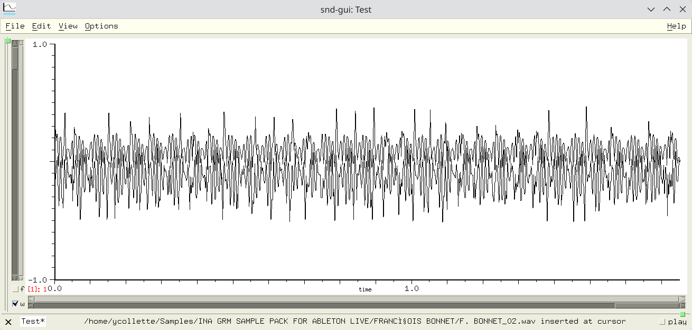

# SND

This document provides practical and up-to-date documentation for using and packaging snd on Fedora and in the Audinux repository.

It is intended for:
- users
- musicians
- researchers
- sound designers



A quick description of the application can be found on the [CCRMA SND Wiki page](https://ccrma.stanford.edu/wiki/Snd).

## Quick overview of snd

**snd** is a research-oriented audio editor developed at CCRMA (Stanford) by Bill Schottstaedt.

Key features:
- Precise audio editing
- Signal analysis
- Advanced scripting via s7 Scheme
- Modular architecture

Unlike Audacity, snd is designed as:
- Editor + audio processing language

## Fedora/Audinux variants

On modern Fedora, it is recommended to provide two variants:
- **snd-gui** version with graphical interface (Motif/X11)
- **snd-nox** version without graphical interface (scripts, servers)

This division replaces the older, now obsolete, **snd-gtk**. This version was based on the now obsolete Gtk2 library.

To install **snd**:
```
$ dnf install snd-gui
$ dnf install snd-nox
```

## snd.conf Configuration (IMPORTANT)

Common Historical Error: many older snd.conf files contain lines like:
```
(cons "/usr/lib64/snd/scheme" *load-path)
```

or **Guile** variants:
```
(%load-path).
```

These lines cause errors with modern **snd** (s7).

## Scheme Module Locations

Scheme modules are installed in:
```
/usr/lib64/snd/scheme/
```

Some important modules:

- effects.scm: DSP Effects
- env.scm: Envelopes
- mix.scm: Non-Destructive Mixing
- marks.scm: Markers

## Built-in Documentation (Main Source)

**snd** provides comprehensive built-in documentation:
```
$ info snd
$ man snd
```

Some complete documentation can be found in:
```
/usr/share/doc/snd/snd.html
```

## Keyboard Cheat Sheet (Summary)

c-a: move cursor to window start
c-e: move cursor to window end
c-v: move cursor to mid-window
c-l: position window so cursor is in the middle
c-f: move cursor ahead one sample
c-b: move cursor back one sample
c-q: play current channel starting at cursor
c-t: stop playing
c-[Space]: start selection definition
c-m: place (or remove) mark at cursor location
c-j: goto mark
c-w: delete (cut) current region
M-w: (copy) current region
c-y: paste in last deleted region
c-_: undo
c-x c-s: save your current edition. 

## s7 Listener — Useful Commands

With **snd-gui**, to access the **s7** console, you must first select: 'View->Show listener' in the main GUI.

Some simple examples:
```
(channels)
(srate)
(sound-length)
(map-channel (lambda (x) (* x 0.5)))
```

## Target Audience and Use Cases

**snd** is particularly well-suited for:
- acoustic analysis
- music research
- scripted audio processing
- non-destructive workflows

## Project Status

Active but discreet development.
Code historically hosted on SourceForge.
No modern official Git repository, only a SVN repository on SourceForge.
