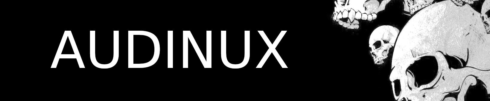

## Build

### Tickets

### Fedora 45

The build is currently running.

#### Errors
- stompboxui: 
```
No match for argument: dotnet-sdk-8.0
```

#### Warnings

## TODO

For Rack v1: use these patches:
- https://github.com/hexdump0815/vcvrack-dockerbuild-v1

For Rack v2: use these patches:
- https://aur.archlinux.org/packages/vcvrack

Patch linuxampler following. this instructions:
- https://rpc.gehennom.org/2015/06/mellotron-on-the-raspberry-pi/

Porting intrinsics to ARM using simde:
- https://wiki.debian.org/SIMDEverywhere

