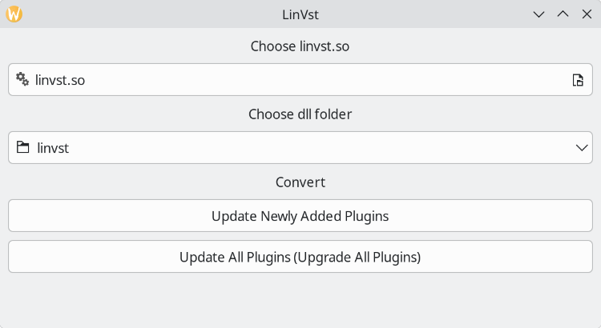

# VST from Windows

## yabridge

yabridge is a wrapper tool which will generate a Linux compatible VST2 / VST3 / CLAP from a VST2 / VST3 / CLAP Windows dll.
The source code of this tool is hosted here: <https://github.com/robbert-vdh/yabridge>

First, install yabridge:
```
$ dnf install yabridge
```

Set the folder where all the Linux compatible VST files will be generated (by default, it's in <USER_HOME>/.vst / <USER_HOME>/.vst3 / <USER_HOME>/.clap):
```
$ yabridgectl set --path=<path>
```

Set the folder where all the VST dll files are installed:
```
$ yabridgectl add <vst_folder>
```

Now run the synchronisation to create all the Linux compatible wrappers:
```
$ yabridgectl sync
```

# linvst

First, let's install a Windows VST via wine:
```
$ wine setup.exe
```

Create a LinVst VST folder:
```
$ mkdir ~/linvst/
```

Move the .dll files of the installed VST to the LinVst VST folder:
```
$ mv *.dll ~/linvst/
```

Start **linvstconvert** to convert the Windows VST files:
```
$ linvstconvert
```
The **linvst.so** file is located here: /usr/share/LinVst/linvst.so

The shape of the **linvstconvert** GUI:


You can also manage the conversion and the activation / deactivation of plugins via **linvstmanage-cli**:
```
=== Manage LinVST plugins ======================================================
| - Error: No config file at: /home/ycollette/.config/linvst/manage/linvstmanage.ini|
| - Using config file: /usr/share/LinVst/manage/linvstmanage.ini               |
| - Using linvst.so: /usr/share/LinVst/linvst.so                               |
|------------------------------------------------------------------------------|
('h' for help) ->>  h
==== Help ======================================================================
| - h: This help message                                                       |
| - q: Quit                                                                    |
| - s: Print status                                                            |
| - u: Update/Create *.so files for all existing VST-dlls                      |
| - r: Remove orphaned so-links (if any) from link-folder                      |
| ---------------------------------------------------------------------------- |
| - e: Enable specified VSTs                                                   |
| - d: Disable specified VSTs                                                  |
|   (i.e. 'e a': enable all disabled VSTs                                      |
|         'd 3': disable VST with index 3                                      |
|         'e 4,5,7': enable VSTs with index 4,5 and 7)                         |
================================================================================
('h' for help) ->> 
```

Now, you can scan for plugins in your DAW ...
